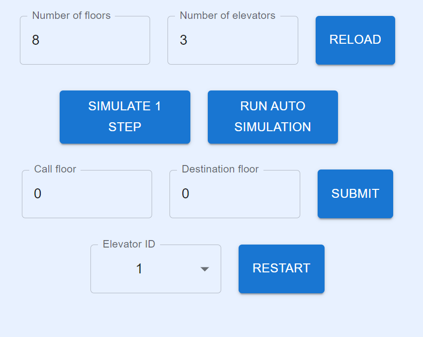

# Elevator System Front

## Guidelines
1. Clone the project
2. Install [Node.js and npm](https://phoenixnap.com/kb/install-node-js-npm-on-windows)
3. Run "npm install" from the console to install all modules
4. Run "npm start" to start the application

## User Interface

#### Control panel

To simulate a single step of the elevator operation, simply click on the "Simulate 1 Step" button.

For an automated simulation, use the "Run Auto Simulation" button. However, it's important to note that this feature may not function as expected. Unlike the step-by-step simulation with the "Simulate 1 Step" button, the auto simulation does not allow the user to add multiple call and destination floors simultaneously. Instead, it is limited to a predefined set of steps or predefined scenarios.